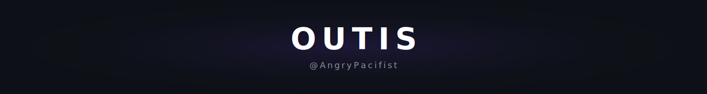
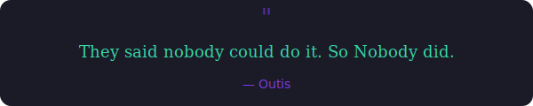

  

  

---

### About

They call me the **machine** — I try things, relentlessly. If it exists, I'll learn it. If it doesn't, I'll build it.

Right now I'm tinkering with AI agents, shipping Solana tooling, and building [Hot Take](https://hottake.markets) — my prediction market startup. Before that I was writing for protocols, leading communities, and figuring out which rabbit hole to fall into next.

I play basketball, I game, and I have a weakness for cats. Not necessarily in that order.

  
  
  
  
  

---

### Featured Projects

<table>
  <tr>
    <td width="50%">
      <h3>⭐ Hot Take</h3>
      
<strong>Prediction markets on Solana</strong>

      
My product. Currently in active development — a TikTok-style prediction market platform with social capture, automated settlement, and embedded wallets.

      

        
        
        
        
      

      <a href="https://hottake.markets">🌐 hottake.markets</a> · <a href="https://x.com/hottake_app">𝕏 @hottake_app</a>
    </td>
    <td width="50%">
      <h3>Solana Security Patterns</h3>
      
<strong>10 Sealevel attack patterns — Anchor vs Pinocchio</strong>

      
An interactive educational reference comparing security patterns across two Solana frameworks. 43+ exploit simulations, 100% logical verification.

      

        
        
        
      

      <a href="https://solana-security-patterns.pxxl.click">🌐 Live Guide</a> · <a href="https://github.com/AngryPacifist/solana-security-patterns">📂 Repo</a>
    </td>
  </tr>
  <tr>
    <td width="50%">
      <h3>Solvent</h3>
      
<strong>Automated rent-reclaim bot for Solana operators</strong>

      
A comprehensive monitoring suite with CLI, Dashboard, and Telegram bot interfaces for reclaiming rent from closeable accounts.

      

        
        
        
        
      

      <a href="https://solvent-kora.vercel.app">🌐 Live Demo</a> · <a href="https://github.com/AngryPacifist/solvent">📂 Repo</a>
    </td>
    <td width="50%">
      <h3>Xanscope</h3>
      
<strong>Analytics platform for Xandeum pNodes</strong>

      
A premium dashboard for monitoring and managing Xandeum storage provider nodes — real-time network health, interactive 3D globe, leaderboard, and operator tools.

      

        
        
        
        
      

      <a href="https://xanscope.vercel.app">🌐 Live Demo</a> · <a href="https://github.com/AngryPacifist/xanscope">📂 Repo</a>
    </td>
  </tr>
</table>

---

### Published Writing

| Article | Topic |
|---------|-------|
| [**Deus Ex DAT**](https://angrypacifist.substack.com/p/deus-ex-dat) | Digital Asset Treasuries on Solana — institutional capital onboarding |
| [**An Introduction to Futarchy**](https://angrypacifist.substack.com/p/the-meta-dao-and-futarchy) | DAO governance via prediction markets |
| [**Nigeria's EV Revolution**](https://angrypacifist.substack.com/p/advancing-electric-mobility) | Deep-dive market analysis of Nigeria's EV infrastructure |
| [**A Framework for Effective Writing**](https://angrypacifist.substack.com/p/research-and-drafting?r=ot0to) | My structured process for research and content creation |

---

### Tech Stack

  
  
  
  
  
  
  
  

---

### GitHub Stats

  
  

---

### Activity

---

### Contribution Snake

  

---

  

---

  

