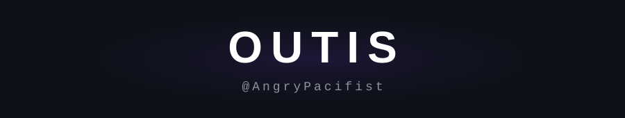

  

  

---

### About

They call me the **machine**. I try things relentlessly, and whatever the work needs I pick up or build.

Right now I'm tinkering with AI agents, contributing upstream to [ZeroClaw](https://github.com/zeroclaw-labs/zeroclaw), shipping Solana tooling, and building [Hot Take](https://hottake.markets), my prediction market startup. Before that I wrote for protocols and led communities.

I play basketball, I game, and I have a weakness for cats.

  
  
  
  
  

---

### Featured Projects

<table>
  <tr>
    <td width="50%">
      <h3>⭐ Hot Take</h3>
      
<strong>Prediction markets on Solana</strong>

      
My product. A TikTok-style feed of real-world markets: scroll, take a stance with Stamp It or Fade It, and trade with real USDC. Shipped to Solana mainnet as a solo founder; relaunching now on our own settlement program.

      

        
        
        
        
      

      <a href="https://hottake.markets">🌐 hottake.markets</a> · <a href="https://x.com/hottake_app">𝕏 @hottake_app</a>
    </td>
    <td width="50%">
      <h3>The Gauntlet</h3>
      
<strong>Elimination trading competition engine for Adrena</strong>

      
Bracket-style tournaments on the Adrena perps protocol: traders register a wallet, trade through timed rounds, and are scored on a composite performance index from live position data until a final group remains.

      

        
        
        
      

      <a href="https://github.com/AngryPacifist/the-gauntlet">📂 Repo</a>
    </td>
  </tr>
  <tr>
    <td width="50%">
      <h3>zeroclaw-x402</h3>
      
<strong>Verified x402 payments on Solana for ZeroClaw agents</strong>

      
An agent that can spend money is a prompt-injection surface. Every settlement is decoded and checked byte-for-byte against the server's own demand before anything is signed, under a spend policy the model cannot talk its way past. Settled real payments on Solana mainnet.

      

        
        
        
      

      <a href="https://github.com/AngryPacifist/zeroclaw-x402">📂 Repo</a>
    </td>
    <td width="50%">
      <h3>ZeroClaw (upstream)</h3>
      
<strong>Contributor to the 32k-star Rust agent runtime</strong>

      
Seven merged PRs in the security, test, cron, and gateway paths of ZeroClaw, including a fail-closed fix to the Verifiable Intent constraint checker that shipped in v0.8.4. 20 artifacts filed upstream: 9 PRs and 11 issues.

      

        
      

      <a href="https://github.com/zeroclaw-labs/zeroclaw">📂 Upstream</a> · <a href="https://github.com/zeroclaw-labs/zeroclaw/pulls?q=is%3Apr+author%3AAngryPacifist">📂 The PRs</a>
    </td>
  </tr>
  <tr>
    <td width="50%">
      <h3>Onside</h3>
      
<strong>Live World Cup prediction game</strong>

      
A continuous feed of "what happens next" micro-calls generated from the live match state and settled by the data feed minutes later, with every eligible result provable against on-chain Merkle roots. Built solo for the TxODDS World Cup Hackathon.

      

        
        
        
      

      <a href="https://onside.today">🌐 onside.today</a> · <a href="https://github.com/AngryPacifist/Onside">📂 Repo</a>
    </td>
    <td width="50%">
      <h3>Candor</h3>
      
<strong>The trading agent that cannot lie about its record</strong>

      
An autonomous sports trading agent that commits every position to Solana mainnet before the outcome exists, then proves each settlement on-chain against anchored match data. Built for the TxODDS World Cup Hackathon.

      

        
        
        
      

      <a href="https://candor.website">🌐 candor.website</a> · <a href="https://github.com/AngryPacifist/Candor">📂 Repo</a>
    </td>
  </tr>
  <tr>
    <td width="50%">
      <h3>Solana Security Patterns</h3>
      
<strong>10 Sealevel attack patterns: Anchor vs Pinocchio</strong>

      
An interactive educational reference comparing security patterns across two Solana frameworks. 43+ exploit simulations, 100% logical verification.

      

        
        
        
      

      <a href="https://solana-security-patterns.vercel.app">🌐 Live Guide</a> · <a href="https://github.com/AngryPacifist/solana-security-patterns">📂 Repo</a>
    </td>
    <td width="50%">
      <h3>Solvent</h3>
      
<strong>Automated rent-reclaim bot for Solana operators</strong>

      
A comprehensive monitoring suite with CLI, Dashboard, and Telegram bot interfaces for reclaiming rent from closeable accounts.

      

        
        
        
        
      

      <a href="https://solvent-kora.vercel.app">🌐 Live Demo</a> · <a href="https://github.com/AngryPacifist/solvent">📂 Repo</a>
    </td>
  </tr>
  <tr>
    <td width="50%">
      <h3>Xanscope</h3>
      
<strong>Analytics platform for Xandeum pNodes</strong>

      
A premium dashboard for monitoring and managing Xandeum storage provider nodes: real-time network health, interactive 3D globe, leaderboard, and operator tools.

      

        
        
        
        
      

      <a href="https://xanscope.vercel.app">🌐 Live Demo</a> · <a href="https://github.com/AngryPacifist/xanscope">📂 Repo</a>
    </td>
    <td width="50%">
      <h3>Ø Zero</h3>
      
<strong>Passkey wallet showcase on Lazorkit</strong>

      
A React Native wallet with biometric passkey login and gasless transactions through the Kora paymaster: send and receive, Solana Pay QR scanning, Jupiter swaps, and Metaplex Core minting.

      

        
        
        
      

      <a href="https://github.com/AngryPacifist/zero-app">📂 Repo</a>
    </td>
  </tr>
</table>

---

### Published Writing

| Article | Topic |
|---------|-------|
| [**Deus Ex DAT**](https://angrypacifist.substack.com/p/deus-ex-dat) | Digital Asset Treasuries on Solana — institutional capital onboarding |
| [**An Introduction to Futarchy**](https://angrypacifist.substack.com/p/the-meta-dao-and-futarchy) | DAO governance via prediction markets |
| [**Nigeria's EV Revolution**](https://angrypacifist.substack.com/p/advancing-electric-mobility) | Deep-dive market analysis of Nigeria's EV infrastructure |
| [**A Framework for Effective Writing**](https://angrypacifist.substack.com/p/research-and-drafting?r=ot0to) | My structured process for research and content creation |

---

### Tech Stack

  
  
  
  
  
  
  
  
  

---

### GitHub Stats

  
  

---

### Activity

---

### Contribution Snake

  <picture>
    <source media="(prefers-color-scheme: dark)" srcset="https://raw.githubusercontent.com/AngryPacifist/AngryPacifist/output/github-snake-dark.svg" />
    
  </picture>

---

  

---

  

